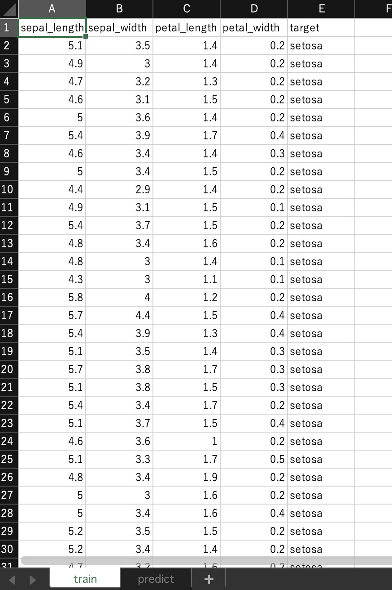
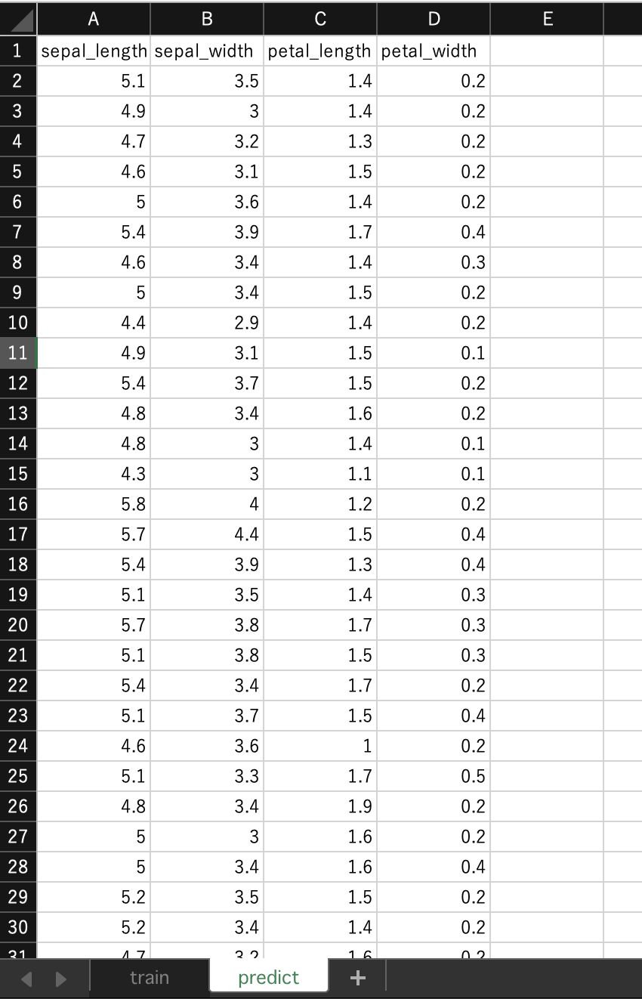
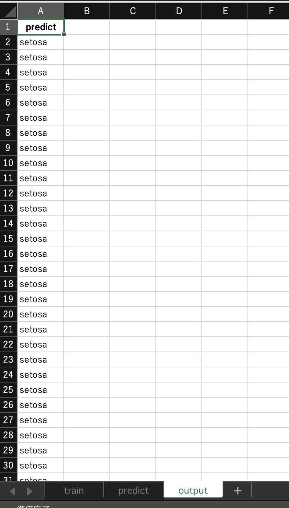

# 概要

エクセルファイルを選択するだけで機械学習ができるアプリです。

# 推しポイント

- クラウドにファイルをアップロードしないので、漏洩の心配がありません
- エクセルファイルを作成して選択するだけなので、操作が簡単です

# ダウンロード

Windows、Mac 用のソフトウェアは以下の URL からダウンロードできます。
https://1drv.ms/u/s!Aq2D9sezILGMh4BnZp0aIf_bJZ7s4g?e=tbYJQW

Windows の場合は exe ファイルをダウンロード、Mac の場合は zip ファイルを解凍して利用してください。

# 使い方

ダウンロードしたソフトウェアをクリックして起動し、テンプレート通りのエクセルファイルを選択すると、機械学習による予測結果がシートに追加されます。


# 詳細な使い方

1. ダウンロードしたソフトウェアをクリックして起動します。起動には時間がかかります。
2. エクセルファイルを用意します。
   例: https://github.com/gepuro/onestep_ml/blob/master/sample.xlsx
   シート名: train には学習用のデータを置きます
   
   予測したいデータのカラム名を「target」にします

3. 予測対象のデータをシート名: predict に置きます
   
   この時、train シートと predict シートの列名を揃えます。違いは target カラムの有無のみです。predict シートには target カラムを置きません。

4. エクセルファイルを選択すると、機械学習が実行されます。

5. エクセルファイルに予測結果が記述されたシートを確認できます。
   

# 実装済み機能

- ロジスティック回帰による分類モデルの作成

# 実装予定の機能

- アプリのアイコンにファイルをドラッグアンドドロップで機械の実行
- 回帰モデルの作成
- 設定用のシートを追加
- モデルの性能評価

# ビルド方法

```
PYTHON_CONFIGURE_OPTS="--enable-framework" pyenv install 3.9.7
pyenv local 3.9.7
pip install poetry
poetry install
poetry run python -m eel main.py web --onefile --noconsole --hidden-import=sklearn.utils._weight_vector --hidden-import=sklearn.utils._weight_vector --hidden-import=sklearn.utils._typedefs
```

# ビルドしたファイルの実行

```
./dist/main
```

# 開発時の実行

```
poetry run python main.py
```
